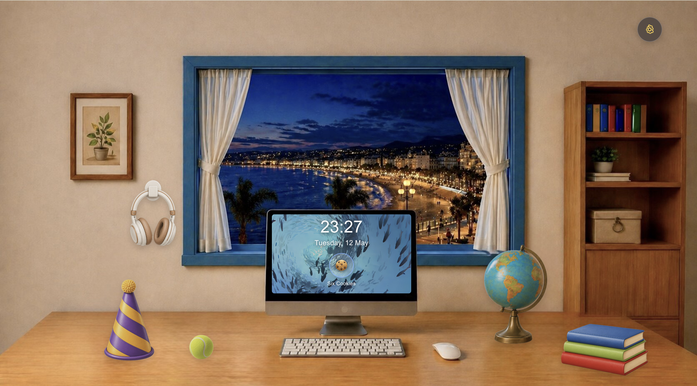

# EchoAtlas · Six Cookies

[](https://www.aucklanduni.ac.nz/)



> **Live deployment:** EchoAtlas is hosted online — open **[https://echoatlas.fit/](https://echoatlas.fit/)** in your browser to try the app without cloning the repo (register or use the [test account](#recommended-test-account) below; **Connect Spotify** may require your Spotify email on our allowlist — see [Spotify Dashboard](#spotify-dashboard)).
>
> **Local development:** After you start the frontend locally, use **`http://127.0.0.1:5173`** — the **IP `127.0.0.1`**, **not** `http://localhost:5173`. Spotify’s OAuth redirect for local dev is registered for `127.0.0.1`; `localhost` often breaks **Connect Spotify** and playback setup.

---

## Start here — test login & Spotify (read this first)

**EchoAtlas needs your own login.** Scene playlists and search call Spotify through the backend, so **each user must link a Spotify account once** (free Spotify is fine).

### Recommended test account

Use this first so you skip registration (course / team demo only — do not reuse elsewhere):

| | |
|--|--|
| **Email** | `xtongfan666@gmail.com` |
| **Password** | `12345678` |

If this account is not in the database, register a new user through the app’s door/login flow.

### If you registered a new account — connect Spotify in 5 steps

1. **Start the app** (backend + frontend; see [Quick start](#quick-start)).  
2. Open the site at **`http://127.0.0.1:5173`** — use **`127.0.0.1`**, not `localhost`, so Spotify’s redirect works.  
3. **Sign in** to EchoAtlas (email/password or Google). Open the **desk** after the door opens.  
4. Click a desk object (**book, party hat, tennis ball, or headphones**) to open the **music player**.  
5. Click **Connect Spotify** → log in with your **Spotify** account → approve. When you return to the app, playlists load and you can play tracks in the embedded player.

**Still stuck?** Check Redirect URI `http://127.0.0.1:5173/spotify-callback` in the [Spotify Developer Dashboard](https://developer.spotify.com/dashboard) (must match exactly). More detail: `Web/backend/docs/SPOTIFY_CONNECT_STEP_BY_STEP.md`.

---

## Playback (full tracks vs previews)

Music plays through Spotify’s **embedded web player** (`iframe`). **Full-length playback vs 30-second previews** is controlled largely by **Spotify**, not only by EchoAtlas:

- **Log into Spotify in the same browser** you use for the app. Open **[Spotify Web](https://open.spotify.com)** in that browser and sign in with **your own Spotify account** (it does **not** have to be the same email as your EchoAtlas login). Then go back to EchoAtlas and use the player. This is especially important on a **new computer** or a **clean browser profile** where you were not already logged into Spotify.
- **Spotify Premium** usually gives the most reliable **full-track** playback in embeds. On **Spotify Free**, you may still get **previews** on some tracks or in some regions—this is normal Spotify behaviour, not a bug in our repo.
- **Quick playback checklist:** Sign in → **Connect Spotify** if needed → open [Spotify Web](https://open.spotify.com) in the **same browser** → open a desk object and play. If playback still sounds restricted, try Spotify **Premium**, another browser, or relax third‑party cookie blocking.

---

## Project overview

**EchoAtlas** is an interactive music-discovery web app for **University of Auckland CS732** (team **Six Cookies**). Users enter a **desk scene**: objects open **context-aware listening** (study, party, sports, headphones); the **globe** opens **Resonance** — a map-linked memory flow (places, photos, songs). The backend provides authentication, a saved library, **Spotify** integration, and **Gemini**-assisted AI suggestions. The client is **React + TypeScript + Vite**; the API is **Spring Boot** with **PostgreSQL**, documented under `docs/`.

---

## Vision & features

| Theme | Description |
|--------|-------------|
| **Scene entry points** | Desk objects map to modes (study, party, sports, headphone listening). |
| **Map memories** | Pick a place, attach photos, bind tracks (internal **Resonance** model). |
| **Streaming** | **Spotify Web API** for search, metadata, embed playback; **Connect Spotify** + **My Favorites**. |
| **AI assist** | Prompts and track resolution (Gemini on the backend). |

---

## What’s on the site

1. **Door / login** — Keypad into the desk; email or Google sign-in.  
2. **Desk** — Objects open the music player; globe opens map + memories; settings for day/night theme and layout.  
3. **Music Player** — **My Favorites**, scene playlists, **AI Music**.  
4. **Map modal** — Place-linked resonances (ordering, trash, etc.).

---

## Tech stack

### Frontend (`Web/frontend`)

| Area | Technologies |
|------|----------------|
| UI | **React 19**, **TypeScript**, **Vite 8** |
| Styling | **Tailwind CSS 4** (`@tailwindcss/vite`) |
| 3D / globe | **react-globe.gl**, **Three.js** |
| Tooling | **ESLint**, **TypeScript ESLint**, npm scripts (`dev`, `build`, `preview`) |

### Backend (`Web/backend`)

| Area | Technologies |
|------|----------------|
| Framework | **Java 17**, **Spring Boot 4** |
| Web & API | Spring Web MVC, **Spring Security**, **Spring Validation** |
| Data | **Spring Data JPA**, **Hibernate**, **PostgreSQL**, **Flyway** migrations |
| Caching / infra | **Spring Cache** + **Caffeine**; **Redis** (when enabled in config) |
| Auth | **JWT** (`jjwt`), session/token flows for email + **Google OAuth** |
| Email | **Spring Mail** (verification / password flows) |
| Integrations | **Spotify Web API** (OAuth PKCE, catalog calls), **Google Maps / Places**, **Gemini** (AI), configurable via `application.yml` |

### Repository & docs

| Item | Location |
|------|----------|
| API shapes | `docs/openapi-auth.yaml`, `docs/API_AUTH.md` |
| Spotify notes | `Web/backend/docs/` |

---

## Repository layout

```
group-project-six-cookies/
├── Web/
│   ├── frontend/          # Vite + React
│   └── backend/           # Spring Boot API
├── docs/                  # API notes, auth & testing guides
└── README.md
```

---

## Prerequisites

- **Node.js** (LTS recommended)  
- **JDK 17**  
- **Maven** 3.8+  
- **PostgreSQL** (or your team’s configured DB URL)  
- **Redis** if required by `application.yml`

---

## Quick start

### Backend

```bash
cd Web/backend
mvn spring-boot:run
```

API base URL is typically **`http://localhost:8080`** (frontend talks to this URL unless you override `VITE_API_BASE_URL`).

### Frontend

```bash
cd Web/frontend
npm install
npm run dev
```

Vite prints a local URL — **ignore `localhost` for browsing.** **Always open:** **`http://127.0.0.1:5173`**.

| Do | Don’t |
|----|--------|
| **`http://127.0.0.1:5173`** | `http://localhost:5173` for normal use |

Spotify’s redirect URI and PKCE callback are aligned with **`127.0.0.1`**. Using **`localhost`** commonly breaks OAuth or leaves **Connect Spotify** stuck.

Optional `Web/frontend/.env` / `.env.local`:

```env
VITE_API_BASE_URL=http://localhost:8080
```

### Spotify Dashboard

Add redirect URI (must match the app exactly):

`http://127.0.0.1:5173/spotify-callback`

**Development mode allowlist (Spotify’s rule, not ours):** New Spotify apps start in **Development** mode. Only Spotify accounts added under **Dashboard → your app → Settings → User management** may call the Web API with your Client ID (currently up to **5** users). If OAuth seems to work but you see **403** / *“not registered for this application”*, someone with Dashboard access must **add that user’s Spotify login email**—or use a shared test Spotify account for demos. This restriction comes from **Spotify**, not from EchoAtlas code.

**Trying a fresh EchoAtlas registration?** Email **any** of the [Six Cookies team](#team-cs732--six-cookies) and include the **Spotify account email** you use when you approve **Connect Spotify** (the same address you would add under User management). After we add it in our Spotify Developer Dashboard, Spotify-linked features should work normally for your new account.

---

## FAQ

- **Frontend cannot reach the API** — Start the backend; set `VITE_API_BASE_URL`.  
- **Spotify fails** — Use **`127.0.0.1`**, match Redirect URI and `spotify.*` in config. **403 / not registered** → add the Spotify account under Dashboard **User management** ([Spotify Dashboard](#spotify-dashboard)).  
- **Only previews when playing** — Log into [Spotify Web](https://open.spotify.com) in the **same browser**; see [Playback](#playback-full-tracks-vs-previews).  
- **Maps / places** — Check Google Maps / Places key and quotas.

---

## License & course context

Course project for **University of Auckland CS732**. Use is limited to team and course requirements unless agreed otherwise.


